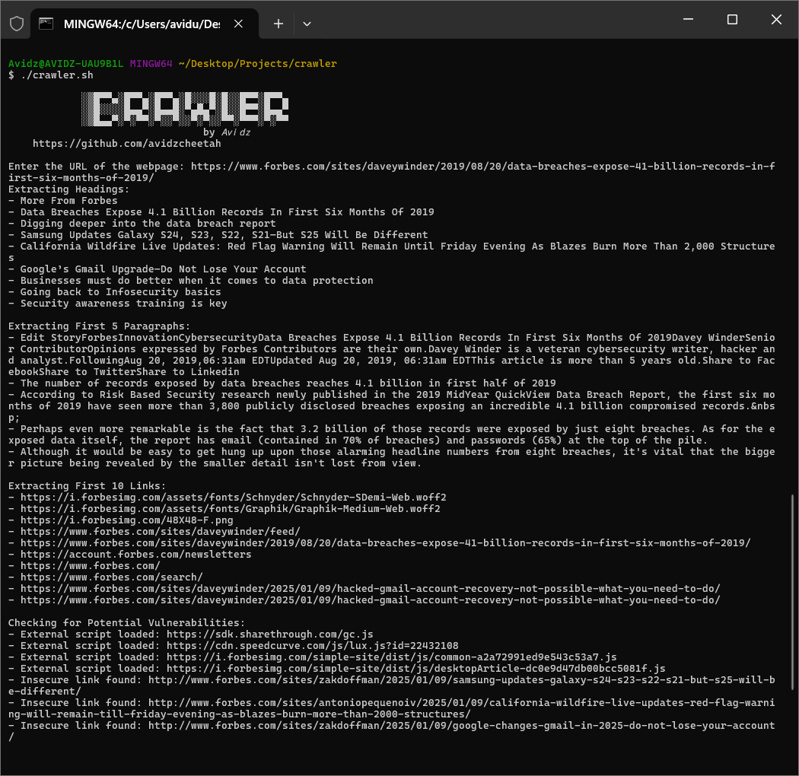

# Bash Web Crawler and Vulnerability Checker

This repository contains a simple Bash script that crawls a user-provided webpage, extracts important points (headings, paragraphs, and links), and identifies potential vulnerabilities such as insecure forms and links.

## Features

- Extracts:
  - Headings (`h1`, `h2`, `h3`, etc.)
  - Paragraphs
  - Links
- Checks for vulnerabilities:
  - Insecure forms (`http` action URLs).
  - External scripts loaded from different domains.
  - Absence of Content Security Policy (CSP).
  - Links using `http` instead of `https`.

## Prerequisites

Before running the script, ensure your system meets the following requirements:

- **Bash**: Installed by default on Linux/macOS. For Windows, install Git Bash or use WSL (Windows Subsystem for Linux).
- **Utilities**: `curl`, `grep`, `sed`, and other standard Unix utilities are required. These come pre-installed on most Unix-like systems.

## How to Use

### Step 1: Clone the Repository

```bash
git clone https://github.com/avidzcheetah/bash-web-crawler.git
cd bash-web-crawler
```

### Step 2: Make the Script Executable

```bash
chmod +x crawler.sh
```

### Step 3: Run the Script

```bash
./crawler.sh
```

When prompted, enter the URL of the webpage you want to analyze.

## Example Output

When you run the script, it will:
1. Extract headings, paragraphs, and links from the webpage.
2. Display potential vulnerabilities, such as insecure forms or links.

### Example Screenshot

Below is a screenshot of the tool's output:



## Contributing

Contributions are welcome! If you:

- Encounter any issues
- Have suggestions or feature requests  

Feel free to open an issue or submit a pull request.

## License

This project is licensed under the MIT License. See the [LICENSE](LICENSE) file for more details.

## Author

Developed by **Avidu Witharana** (Avidz).  
For inquiries or suggestions, feel free to contact me at [avidu@ieee.org](mailto:avidu@ieee.org).

